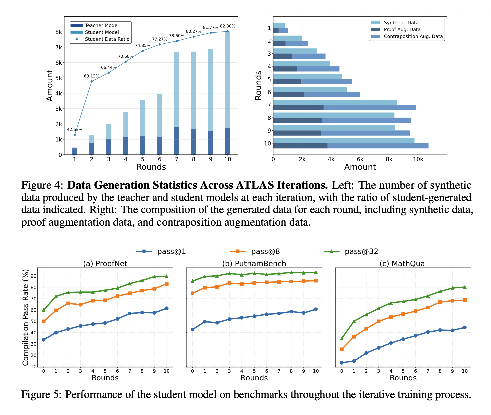
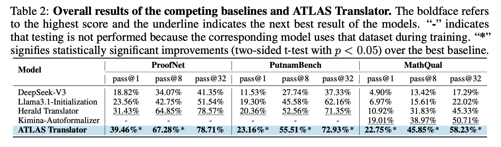
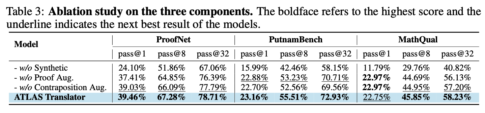
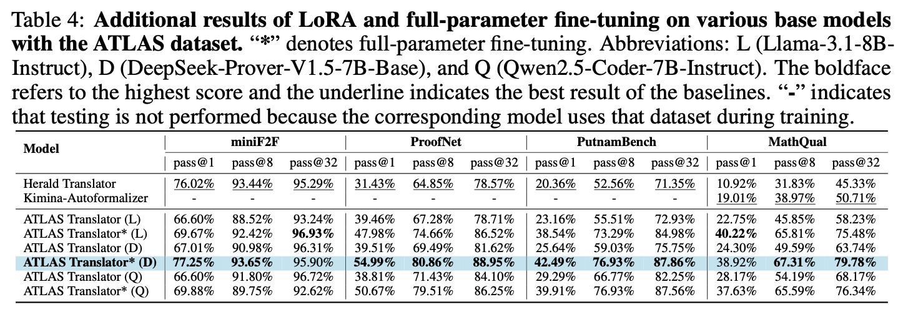

# [NeurIPS 2025] ATLAS

📝Official implementation for the paper:

[ATLAS: Autoformalizing Theorems through Lifting, Augmentation, and Synthesis of Data](https://arxiv.org/abs/2502.05567)


## 1. Introduction
Autoformalization, the automatic translation of mathematical content from natural language into machine-verifiable formal languages, has seen significant progress driven by advances in large language models (LLMs). Nonetheless, a primary barrier to further improvements is the limited availability of parallel corpora that map informal mathematical text to its formal counterpart. To address this limitation, we propose ATLAS (Autoformalizing Theorems through Lifting, Augmentation, and Synthesis of Data), a novel data generation framework designed to produce large-scale, high-quality parallel corpora of theorem statements. Distinct from prior approaches, ATLAS begins with a concept repository, accelerates the improvement of the student model through expert iteration combined with knowledge distillation, and introduces two novel augmentation strategies that exploit the structural characteristics of formal languages. Running the proposed ATLAS framework for 10 iterations, we construct an undergraduate-level dataset of 117k theorem statements and develop the ATLAS Translator by fine-tuning Llama3.1-8B-Instruct with LoRA. This model establishes a new state of the art, demonstrating statistically significant improvements over both the Herald Translator and the Kimina-Autoformalizer across all benchmarks ($p<0.05$, two-sided t-test). Furthermore, we demonstrate that the full-parameter fine-tuning of a stronger base model on the ATLAS dataset leads to superior performance.


## 2. Evaluation Results
The ATLAS Translator series models and the ATLAS dataset used in this paper are publicly available at the following repository: [🤗 HuggingFace](https://huggingface.co/collections/XiaoyangLiu-sjtu/atlas-68d63dffd479f2553b1ca7d9).


**Data Generation Statistics**
The following figure illustrates the evolution of data statistics and model performance across the 10 rounds of our data generation process.



**Overall results**
The following table presents the overall experimental results, including the performance of our ATLAS Translator, which was developed by fine-tuning the Llama3.1-8B-Instruct model on our ATLAS dataset.



**Ablation study**
Our ablation study uses Llama3.1-8B-Instruct as the base model and the LoRA method for fine-tuning to evaluate the impact of training on different datasets.



**Additional results**
To compare the impact of different base models and fine-tuning techniques, we evaluated three base models using both LoRA and full-parameter fine-tuning. Based on these results, we are publicly releasing the three best-performing models from the full-parameter fine-tuning experiments.




## 3. Quick Start
1. **Install Lean4**
    Follow the instructions on the [Lean4 installation page](https://leanprover-community.github.io/get_started.html) to set up Lean4.

2. **Clone the repository**
    ```sh
    git clone https://github.com/XiaoyangLiu-sjtu/ATLAS.git
    cd ATLAS
    ```

3. **Build REPL**
    Follow the instructions on the [Lean REPL page](https://github.com/leanprover-community/repl.git) to set up Lean REPL and change the `DEFAULT_LEAN_WORKSPACE` in `src/workers/verifier.py` to your REPL path.

4. **Modify the configs**
    Modify the contents of `config_evaluation.py` and `config_generation.py` in the folder `configs`

4. **Generation**
    `generation.py` corresponds to the complete data generation process in the paper.

4. **Evaluation**
    Specify model, seed, benchmark, and pass@k in `generation.py` to conduct comparative experiments.
    

## 4. Citation
```bibtex
@inproceedings{liu2025atlas,
  title={ATLAS: Autoformalizing Theorems through Lifting, Augmentation, and Synthesis of Data},
  author={Liu, Xiaoyang and Bao, Kangjie and Zhang, Jiashuo and Liu, Yunqi and Chen, Yu and Liu, Yuntian and Jiao, Yang and Luo, Tao},
  booktitle={The Thirty-ninth Annual Conference on Neural Information Processing Systems},
  year={2025}
}
```


## 5. Contact
Feel free to discuss the paper/data/code with us through issues/emails!
- Xiaoyang Liu: xiaoyang.liu@sjtu.edu.cn


## 6. Acknowledgement
This repo benefits from [Herald Translator](https://github.com/frenzymath/herald_translator) and [DeepSeek-Prover-V1.5](https://github.com/deepseek-ai/DeepSeek-Prover-V1.5). Thanks for their wonderful works.